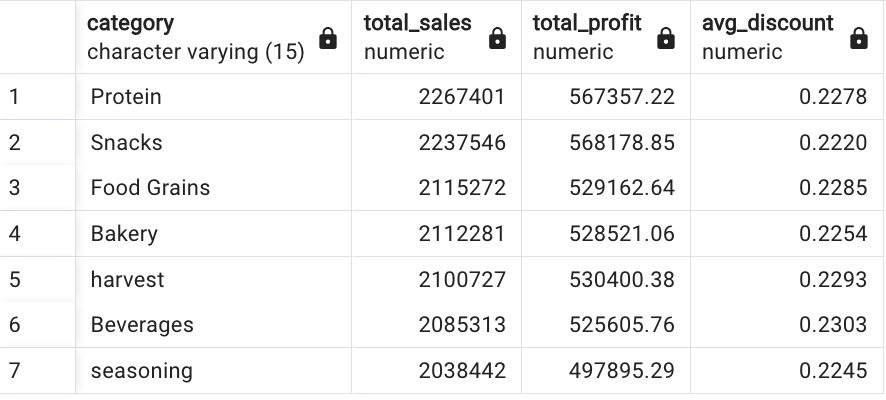
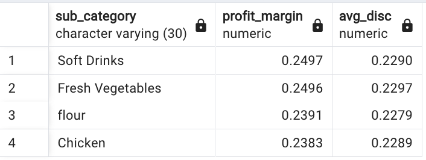
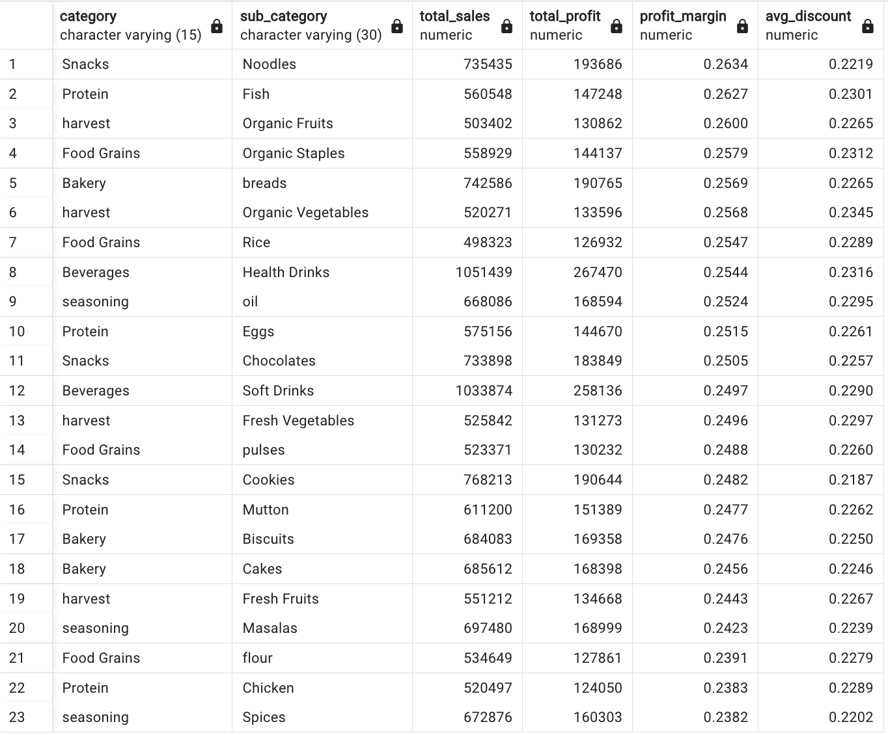
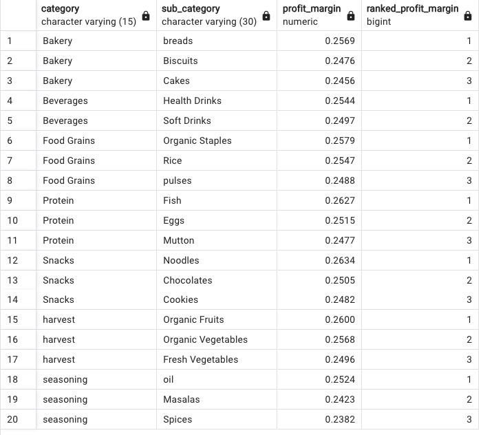

# Retail Data Analysis Using SQL

## Project Overview

This project presents a structured SQL-based analysis of a Superstore sales dataset sourced from Kaggle. The goal was to explore how sales, profit, and discounts interact across product categories and sub-categories to generate actionable business insights.

## Business Objective

 By analyzing product category and sub-category performance, the aim is to uncover patterns in sales, profit margins, and discounting behavior to improve overall profitability and reduce promotional inefficiencies.

## Tools & Techniques

- **Python** : Data cleaning and exploratory data analysis
- **SQL** (Window Functions, CTE, Aggregations, Ranking, Grouping)
- **Business Intelligence Approach**: Focused on real-world retail KPIs— revenue, volume, profit margin and discounts.

## Data Cleaning and Exploration:

The dataset used for this project was sourced from Kaggle: [Supermart Grocery Sales – Retail Analytics Dataset](https://www.kaggle.com/datasets/mohamedharris/supermart-grocery-sales-retail-analytics-dataset)
After loading the CSV file into a DataFrame, initial data exploration was performed.

**Data Type Checks and Date Cleaning**:  
1) Each column's data type was reviewed, and the Date column was found to contain inconsistent formats (e.g., slashes and dashes used interchangeably). To address this, all slashes were replaced with dashes, and the column was converted to datetime format using pandas.to_datetime(). 
2) Summary Statistics and Missing Values: 
Summary statistics were generated for the Sales, Discount, and Profit columns. The dataset was then checked for missing values and duplicate rows—none were found.

3) Outlier Detection: 
Box plots were created for Sales, Discount, and Profit to identify outliers. Outliers were particularly notable in the Profit column. 

4) Column Renaming for Simplification: 
Product category names were standardized for consistency. For example: 
Oil and Masala → Seasoning 
Eggs, Meat and Fish → Protein 
Fruits and Veggies → Harvest 
Sub-categories were also renamed for clarity: 
Atta and Flour → Flour 
Edible Oil and Ghee → Oil 
Dals and Pulses → Pulses 
Breads and Buns → Breads 
5) Correlation Analysis: 
A heatmap and scatter plots were used to explore relationships between key variables: 
  

A positive correlation was observed between Sales and Profit.

No significant correlation was found between Sales and Discount, or between Discount and Profit. 
      

6) Exporting Cleaned Data: 
The cleaned and transformed DataFrame was saved as a CSV file for further analysis in a PostgreSQL database.

## Analysis Summary

The analysis began with a top-level evaluation of how each category contributed to sales, profit, and discounting behavior. Protein led in total sales, while Snacks emerged as the most profitable category. Beverages had the highest average discount, raising questions around the efficiency of promotional strategies.

To better understand sub_category performance, the overall average profit margin and average discount rate were calculated. These benchmarks helped surface underperforming promotions—specifically those sub-categories with below-average margins and above-average discounts.

A closer look at sub-category performance revealed a few concerning patterns. Chicken, Flour, Fresh Vegetables, and Soft Drinks were all heavily discounted yet delivered weak profit margins. When sales volume was assessed, Soft Drinks showed higher demand—suggesting promotional effectiveness—while the other three lagged in both volume and profitability.

On the other end, sub-categories like Noodles stood out for their superior profit margins, while Organic Vegetables, Health Drinks, Organic Staples, and Fish demonstrated high discounts paired with strong margins—indicating potentially efficient promotions worth doubling down on.

Ranking sub-categories by profit margin within their respective categories helped further highlight high-potential performers and candidates for strategic repricing.

Discounts were grouped into brackets to evaluate their impact on sales and profitability. Interestingly, the highest average profit occurred in the high discount range (21%–30%).

* Sales peaked in the medium discount range (11%–20%), suggesting an effective balance between volume and value.
* Low discounts (≤10%) showed the lowest average profit and sales, indicating limited effectiveness.

## Conclusion & Action Plan

* Reevaluate Discounts on Chicken, Flour, and Fresh Vegetables where deep discounting is not driving meaningful volume or profitability.
* Review Pricing Strategy for Spices and Soft Drinks to improve margins without harming sales performance.
* Prioritize High-Margin Products like Noodles by increasing visibility and ensuring consistent stock availability.
* Strengthen Promotion Efficiency by focusing on categories like Organic Vegetables and Health Drinks, where higher discounts are yielding strong profits.
* Continue Sub-Category Ranking regularly for assortment planning and targeted marketing strategies.
* Prioritize testing and scaling promotions in the 11%–30% discount range, while reevaluating or phasing out low-discount strategies that show limited impact on sales and profitability.

## File Structure

**images** - Visuals used in the README (screenshots)  
**output** - Contains final cleaned dataset: cleaned_data.csv  
**Resources** - Contains the original/raw data files  
**sql_queries** - SQL schema and query files used for analysis  
**data_clean.csv** - Python script for cleaning raw data and EDA  
**README.md** - Project overview and documentation  

