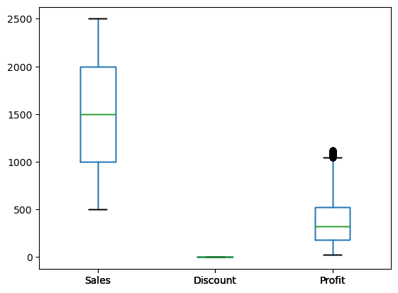
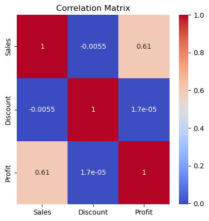
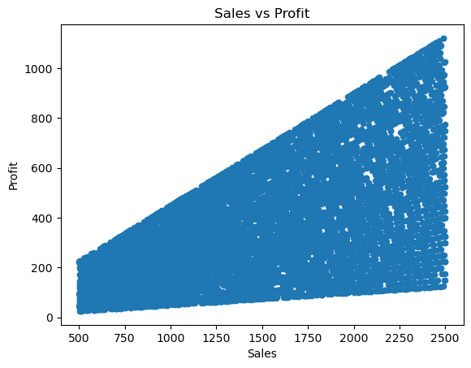
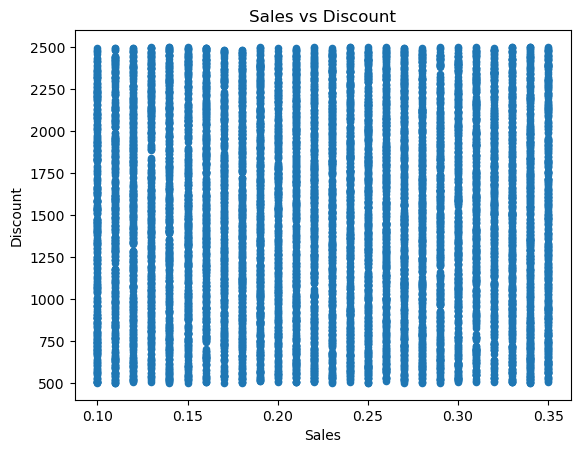
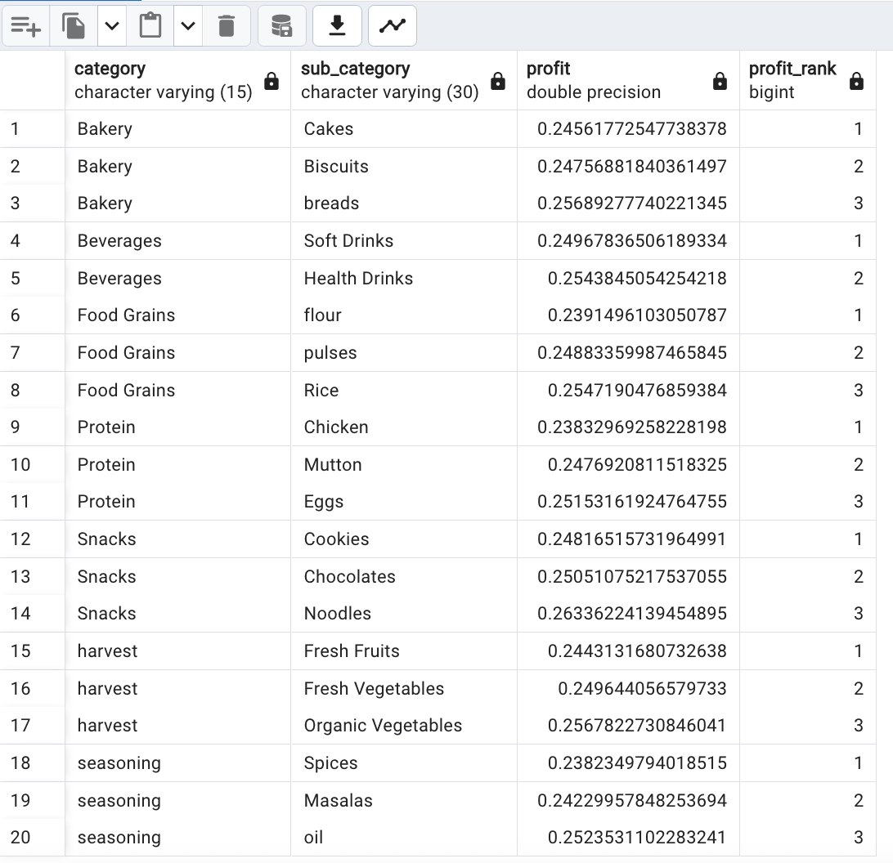
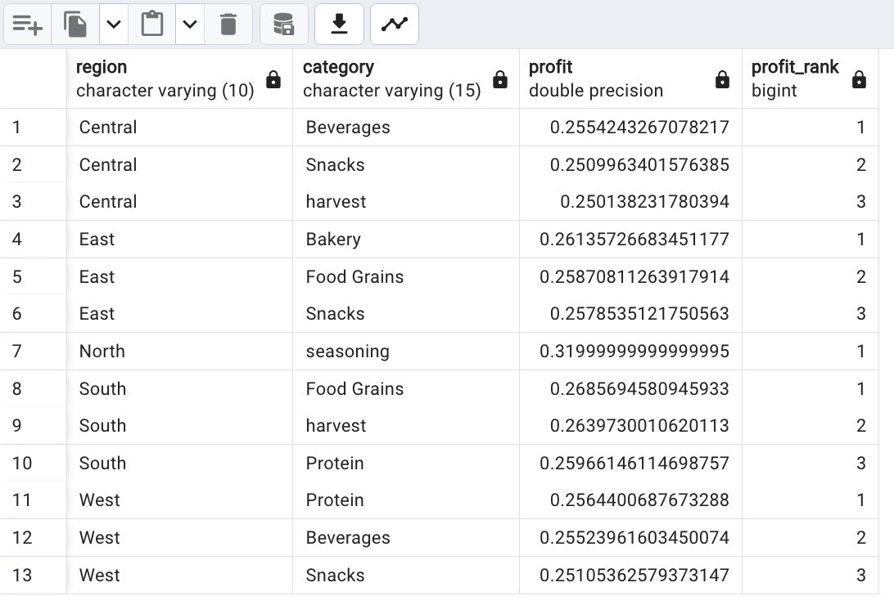
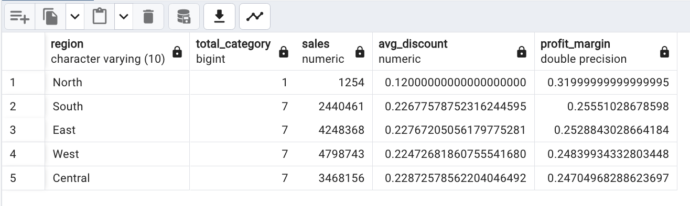

# Retail Data Analysis Using SQL

## Project Overview

This project involves a comprehensive SQL-based analysis of a retail dataset to uncover insights at both **product** and **regional** levels in order to support strategic decision-making around **promotional pricing** and **market expansion**.

## Business Objective

To analyze product and regional sales data to uncover opportunities for **profit optimization** and **regional performance improvement**. The goal is to identify:

- Regions that are under-penetrated or inefficient in terms of sales and profitability.
- Actionable strategies to drive growth.

## Problem Context

A retail company operates across multiple regions and offers a wide variety of product categories. While overall revenue is growing, there are untapped opportunities in certain markets and inefficiencies in others. There is a need to:

- Investigate **regional differences** in sales performance, discounting strategies, and profit margins.
- Make data-driven decisions around **expansion** and **promotion**.

## Tools & Techniques

- **Python** : Data cleaning and exploratory data analysis
- **SQL** (Window Functions, Aggregations, Ranking, Grouping)
- **Business Intelligence Approach**: Focused on real-world retail KPIs—sales, profit margin, discounts, and regional penetration

## Data Cleaning and Exploration:

The dataset used for this project was sourced from Kaggle: [Supermart Grocery Sales – Retail Analytics Dataset](https://www.kaggle.com/datasets/mohamedharris/supermart-grocery-sales-retail-analytics-dataset)
After loading the CSV file into a DataFrame, initial data exploration was performed.

**Data Type Checks and Date Cleaning**:  
1) Each column's data type was reviewed, and the Date column was found to contain inconsistent formats (e.g., slashes and dashes used interchangeably). To address this, all slashes were replaced with dashes, and the column was converted to datetime format using pandas.to_datetime(). 
2) Summary Statistics and Missing Values: 
Summary statistics were generated for the Sales, Discount, and Profit columns. The dataset was then checked for missing values and duplicate rows—none were found. 

3) Outlier Detection: 
Box plots were created for Sales, Discount, and Profit to identify outliers. Outliers were particularly notable in the Profit column. 

4) Column Renaming for Simplification: 
Product category names were standardized for consistency. For example: 
Oil and Masala → Seasoning 
Eggs, Meat and Fish → Protein 
Fruits and Veggies → Harvest 
Sub-categories were also renamed for clarity: 
Atta and Flour → Flour 
Edible Oil and Ghee → Oil 
Dals and Pulses → Pulses 
Breads and Buns → Breads 
5) Correlation Analysis: 
A heatmap and scatter plots were used to explore relationships between key variables: 
A positive correlation was observed between Sales and Profit.
No significant correlation was found between Sales and Discount, or between Discount and Profit. 
         
  
    
6) Exporting Cleaned Data: 
The cleaned and transformed DataFrame was saved as a CSV file for further analysis in a PostgreSQL database.

## Analysis Summary

### Product-Level Analysis
- **Top categories by sales**: `Protein`, `Snacks`, and `Food Grains`
- **Top categories by profit margin**: `Snacks`, `Harvest`, and `Beverages`
- Used **window functions** to rank **top 3 sub-categories** by profit margin within each category.

### Regional Analysis
- Identified **top 3 categories by profit margin per region**

- North region stood out with the **highest profit margin (31%)** but had **only one category and one city (Vellore)**—an outlier with only one recorded transaction.
- Compared **total sales, average discounts, and profit margins** across all regions.

## Key Insights

- **North**: Likely a data anomaly—only one transaction, but shows potential if verified.
- **South**: Under-leveraged, high potential for expansion with improved promotions.
- **Central**: Highest discounts but lowest profit margin and underwhelming sales—needs urgent optimization.
- **East & West**: High sales with moderate profitability—mature markets that should be maintained and fine-tuned.

## Conclusion & Action Plan

| Region   | Strategy         | Action                                                              |
|----------|------------------|---------------------------------------------------------------------|
| North    | Investigate      | assess expansion feasibility                         |
| South    | Expand           | Boost sales through targeted promotions                             |
| Central  | Optimize         | Reduce discounts, reassess product mix                              |
| East     | Maintain & refine| Monitor product performance and improve profit margins              |
| West     | Maintain & refine| Reduce discount leakage and protect margins                         |

---

## File Structure

**images** - Visuals used in the README (screenshots)  
**output** - Contains final cleaned dataset: cleaned_data.csv  
**Resources** - Contains the original/raw data files  
**sql_queries** - SQL schema and query files used for analysis  
**data_clean.csv** - Python script for cleaning raw data and EDA  
**README.md** - Project overview and documentation  

