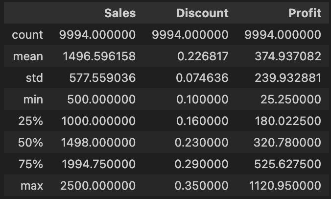
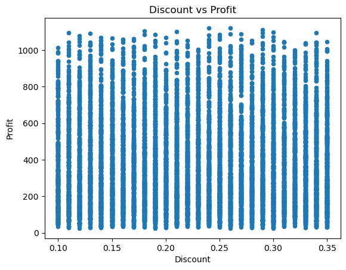

# Retail Data Analysis Using SQL

## Project Overview

This project presents a structured SQL-based analysis of a Superstore sales dataset sourced from Kaggle. The goal is to uncover insights that support smarter pricing, promotion, and product assortment decisions.

## Objective

 By analyzing product category and sub-category performance, the aim is to uncover patterns in sales, profit margins, and discounting behavior to improve overall profitability and reduce promotional inefficiencies.

##  Dataset Overview
Source: Kaggle – [Supermart Grocery Sales – Retail Analytics Dataset](https://www.kaggle.com/datasets/mohamedharris/supermart-grocery-sales-retail-analytics-dataset)  
Records: 9,994  
Fields: Order ID, Customer Name, Category, Sub-Category, City, Order Date, Region, Sales, Discount, Profit, and State.

## Tools & Techniques

- **Python** : Data cleaning and exploratory data analysis
- **SQL** (Window Functions, CTE, Aggregations, Ranking, Grouping)
- **Business Intelligence Approach**: Focused on real-world retail KPIs— revenue, volume, profit margin and discounts.

## Data Cleaning and Exploration:

The dataset used for this project was sourced from Kaggle: [Supermart Grocery Sales – Retail Analytics Dataset](https://www.kaggle.com/datasets/mohamedharris/supermart-grocery-sales-retail-analytics-dataset)
After loading the CSV file into a DataFrame, the following cleaning and exploration steps were performed:

**Data Type Checks and Date Cleaning**:  
1) Reviewed data types across all columns. 
2) Identified inconsistent date formats (slashes vs. dashes) in the Order Date column.
3) Standardized date formatting by replacing slashes and applying pandas.to_datetime().

**Summary Statistics and Missing Values**: 
1) Generated descriptive statistics for Sales, Discount, and Profit columns. 
2) Checked for missing values and duplicate rows — none found.

**Outlier Detection**: 
1) Created box plots for Sales, Discount, and Profit. 
2) Notable outliers identified in the Profit column.

**Column Renaming for Simplification**: 
Standardized product category names: 
* Oil and Masala → Seasoning 
* Eggs, Meat and Fish → Protein 
* Fruits and Veggies → Harvest 
Standardized sub-category names: 
* Atta and Flour → Flour 
* Edible Oil and Ghee → Oil 
* Dals and Pulses → Pulses 
* Breads and Buns → Breads 

**Correlation Analysis**: 
Explored relationships between Sales, Profit, and Discount using heatmaps and scatter plots. 
  

Found a positive correlation between Sales and Profit.

No significant correlation observed between Sales and Discount or Discount and Profit. 
      

**Exporting Cleaned Data**: 
Saved the cleaned and transformed DataFrame as a CSV file for SQL-based analysis in PostgreSQL.

## Analysis Summary

* Category-Level KPI Analysis
    * Calculated total sales, total profit, and average discount per category.
    * Findings:
        * Protein led in total sales.
        * Snacks delivered the highest total profit.
        * Beverages showed the highest average discount, raising concerns about over-discounting.

* Sub-Category Profitability Breakdown
    * Assessed sub-category sales, profit, profit margins, and discounts.
    * Findings:
        * Noodles had the highest profit margin.
        * Spices achieved decent sales but had the lowest margin, suggesting pricing or cost concerns.
        * Chicken (within Protein) showed strong sales but second-lowest profit margin.
        * Organic Vegetables, Health Drinks, Organic Staples, and Fish had high discount rates but maintained strong profit margins, signaling efficient promotional bets.

        

* Benchmarking Against Averages
    * Established overall profit margin and average discount to set performance benchmarks.

* Identifying Underperforming Promotions
    * Flagged sub-categories with below-average margins and above-average discounts.
    * Problem Areas Identified:
        * Soft Drinks, Fresh Vegetables, Flour, Chicken — heavily discounted but not delivering proportional returns.

 

* Analyzing Sales Volume Impact
    * Checked order volumes across sub-categories to see if discounts were driving sales.
    * Findings:
        * Soft Drinks had high volume, suggesting promo-driven demand.
        * Chicken, Flour, and Fresh Vegetables showed low volumes despite discounts, indicating ineffective markdowns.

 

* Evaluating Discount Effectiveness
    * Grouped discounts into brackets (low, medium, high) to assess impact on sales and profit.
    * Findings:
        * Highest average profits came from high discount range (21–30%).
        * Sales peaked in the medium discount range (11–20%), suggesting this level offers the best volume-to-value balance.
        * Low discount group (≤10%) underperformed on both sales and profit.
 

* Ranking Top Performers
    * Ranked sub-categories within each main category by profit margin.
    * Takeaway: High-margin sub-categories were identified as top investment and promotion targets.

 

## Strategic Recommendations

* Reevaluate Discounts on Chicken, Flour, and Fresh Vegetables where deep discounting is not driving meaningful volume or profitability.
* Review Pricing Strategy for Spices and Soft Drinks to improve margins without harming sales performance.
* Prioritize High-Margin Products like Noodles by increasing visibility and ensuring consistent stock availability.
* Strengthen Promotion Efficiency by focusing on categories like Organic Vegetables and Health Drinks, where higher discounts are yielding strong profits.
* Continue Sub-Category Ranking regularly for assortment planning and targeted marketing strategies.
* Rethink aggressive discounting, as medium-level discounts (11–20%) appear just as effective in driving profit and sales as deeper markdowns.

## File Structure

**images** - Visuals used in the README (screenshots)  
**output** - Contains final cleaned dataset: cleaned_data.csv  
**Resources** - Contains the original/raw data files  
**sql_queries** - SQL schema and query files used for analysis  
**data_clean.csv** - Python script for cleaning raw data and EDA  
**README.md** - Project overview and documentation  

